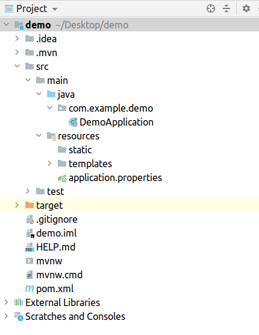

## Spring Framework & Spring Boot


Spring initially started as [Dependency Injection (DI)](https://en.wikipedia.org/wiki/Dependency_injection) framework and grew to a large eco system
covering large areas of software development.

> ℹ For more details checkout [Inversion of Control Containers and the Dependency Injection pattern](https://martinfowler.com/articles/injection.html).

For the purposes of this course we will have a brief look at how to set up a simple web application.

### Spring Boot Initializer

[Spring Boot](https://spring.io/projects/spring-boot) is a project that can be used to create stand-alone applications
with minimal configurations. It allows developers to focus more on the features they are building and worry less about
configuring and setting up the project.

To create a Spring Boot application we can use the [Spring Initializer](https://start.spring.io/). 
This UI allows us to specify the kind of application we want and have it pre-configured with the dependencies that we specify.


The spring initializer will create a sample project that has the following structure assuming Maven is chosen as a build tool:



- `mvnw` is a wrapper around maven. It can be used directly from the command line. This allows us to skip installing maven.
- `src/main/java` is where the actual application code resides
- `src/test/java` is where test code resides
- `src/main/resources/application.properties` is the configuration file that can be used to configure the server and application
- `src/main/resources/static` is where static content like html, css, images etc... reside
- `src/main/resources/templates` is where *thymeleaf* templates reside


##### Running the application.

The generated `DemoApplication` class looks like this:

```java
import org.springframework.boot.SpringApplication;
import org.springframework.boot.autoconfigure.SpringBootApplication;

@SpringBootApplication
public class DemoApplication {

	public static void main(String[] args) {
		SpringApplication.run(DemoApplication.class, args);
	}
}
```

Basically we have an annotated class with `@SpringBootApplication` that tells the framework that this is a spring 
boot app, and a single `SpringApplication.run(...)` which starts the actual http application.

You can start the application either from the IDE or from the command line by executing `./mvnw spring-boot:run`.  
By default, the web server starts on port `8080` and can be accessed on [localhost:8080](http://localhost:8080).


##### Create an HTTP endpoint.

```java
import org.springframework.web.bind.annotation.RequestMapping;
import org.springframework.web.bind.annotation.RequestMethod;
import org.springframework.web.bind.annotation.RestController;

@RestController
public class GreetingController {

    @RequestMapping(method = RequestMethod.GET, path = "/greetings")
    public String greet() {
        return "Greetings from Spring Boot!";
    }
}
```

We use the annotation `@RestController` on the class level to indicate that it will be responsible for handling HTTP requests.  
We also use `@RequestMapping` to annotate the method `greet`. This signals to spring boot that the method will be used as a request handler.  
In order to invoke this method we must issue a `GET` http request to `/greetings`.
This can be done by pasting this link in the browser [localhost:8080/greetings](http://localhost:8080/greetings).

##### Passing HTTP request parameters

```java
import org.springframework.web.bind.annotation.RequestMapping;
import org.springframework.web.bind.annotation.RequestMethod;
import org.springframework.web.bind.annotation.RequestParam;
import org.springframework.web.bind.annotation.RestController;

@RestController
public class GreetingController {

    @RequestMapping(method = RequestMethod.GET, path = "/greetings")
    public String greet(@RequestParam(name = "name", required = false, defaultValue = "World") String name) {
        return "Greetings from " + name + "!";
    }
}
```

In the example above we use the annotation `@RequestParam` to annotate a method parameter `name`.
The annotation also has some additional parameters that specify the URL query parameter name `name="name"`, if it is required `required=false` and
a default value if such a parameter is not provided `defaultValue="World"`.

The above endpoint can be accessed via (localhost:8080/greetings?name=Max)[http://localhost:8080/greetings?name=Max].

> All the examples above returned a HTTP response with `Content-Type: text/html;charset=UTF-8` since we used the `@RestController` annotation.


##### Creating thymeleaf html template

We can use thymeleaf templates to create web pages server by Spring Boot on which the user can interact with the server.
One example would be to have a web page with a http form that the user can fill and submit to the server.

Here is a simplified example that renders a html page.
Since this time we will be using a thymeleaf template we must create a new class and annotate it this time with `@Controller`.

```java
import org.springframework.stereotype.Controller;
import org.springframework.ui.Model;
import org.springframework.web.bind.annotation.GetMapping;
import org.springframework.web.bind.annotation.RequestParam;

@Controller
public class HelloController {

    @GetMapping("/hello")
    public String hello(
            @RequestParam(name = "name", required = false, defaultValue = "World") String name, Model model) {
        model.addAttribute("name", name);
        return "hello";
    }
}
```

The syntax is similar to the previous one except that this time we annotate the class with `@Controller` since we will 
be returning a *thymeleaf* template, and we also pass a `Model` to the method.  


Here is the thymeleaf template located at `src/main/resources/templates/hello.html`.
**IMPORTANT NOTE:** `HelloController#hello` returns the string `hello`. This means that a thymeleaf template with 
the name `hello.html` needs to be present at `src/main/resources/templates/`

```html
<!DOCTYPE HTML>
<html xmlns:th="http://www.thymeleaf.org">
<head>
    <title>Hello Started: Serving Web Content</title>
    <meta http-equiv="Content-Type" content="text/html; charset=UTF-8"/>
</head>
<body>
<p style="color: red" th:text="'Hello, ' + ${name} + '!'"/>
</body>
</html>
```

This page can be visited via [localhost:8080/hello?name=Max](http://localhost:8080/hello?name=Max)
