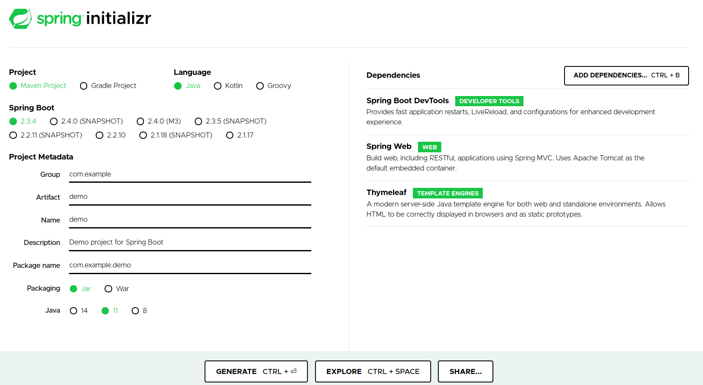

## Spring Framework & Spring Boot

Spring initially started as [Dependency Injection (DI)](https://en.wikipedia.org/wiki/Dependency_injection) framework and grew to a large eco system
covering large areas of software development.

> ℹ For more details checkout [Inversion of Control Containers and the Dependency Injection pattern](https://martinfowler.com/articles/injection.html).

For the purposes of this course we will have a brief look at how to set up a simple web application.

### Spring Boot Initializer

[Spring Boot](https://spring.io/projects/spring-boot) is a project that can be used to create stand-alone applications
with minimal configurations. It allows developers to focus more on the features they are building and worry less about
configuring and setting up the project.

To create a Spring Boot application we can use the [Spring Initializer](https://start.spring.io/). 
This UI allows us to specify the kind of application we want and have it pre-configured with the dependencies that we specify.

